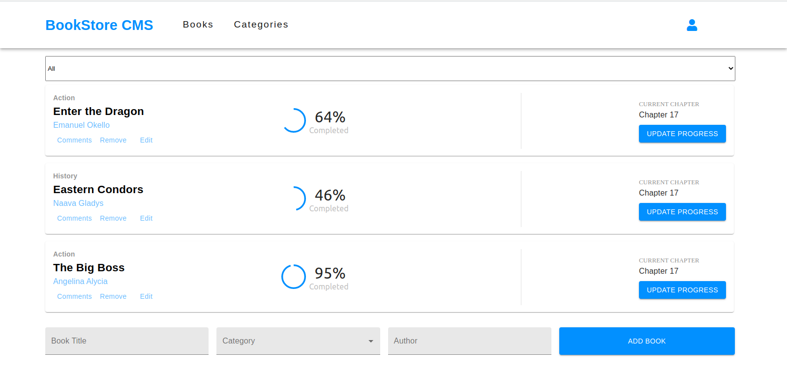

## Book Store App
This is a simple Book Store React/Redux App. The purpose of this project is to use React and Redux to build a professional Book Store app where users perform CRUD operations.

## Screenshot


## Technology
- ReactJs
- Redux
- React-Redux
- Material UI
- JavaScript

## Live Demo

[Live Demo Link](https://book-store-uganda.herokuapp.com/)


## Getting Started

To get a local copy up and running follow these simple example steps.

1. ``` git clone  ```
2. ``` cd Book-Store-App ```
3. ``` git checkout  feature/milestone-1```
4. ``` npm i ```
5. ``` npm run dev``` to run the server in development mode and server will open at `localhost:3000`.
6. ```npm run build ``` to create an optimized production build.
7. ``` npm run start ``` to run the production build locally.
8. Open your favorite browser @ ```127.0.0.1:8080```

This project was bootstrapped with [Create React App](https://github.com/facebook/create-react-app).


### Prerequisites

- A modern browser

## Contirbutor

👤 **Emanuel Okello**

- GitHub: [oxenprogrammer](https://github.com/oxenprogrammer)
- Twitter: [@ox_emmy](https://twitter.com/ox_emmy)
- LinkedIn: [Emanuel Okello](https://www.linkedin.com/in/emanuel-okello/)

## 🤝 Contributing

Contributions, issues and feature requests are welcome!

Feel free to check the [issues page](https://github.com/oxenprogrammer/Book-Store-App/issues).


1. Fork it (https://github.com/oxenprogrammer/Book-Store-App)
2. Create your feature branch (git checkout -b my-new-feature)
3. Commit your changes (git commit -am 'Add some feature')
4. Push to the branch (git push origin my-new-feature)
5. Create a new Pull Request

## Show your support

Give us a ⭐️ if you like this project!

## Acknowledgments

- MIcroverse

## 📝 License

This project is [MIT](./LICENSE) licensed.